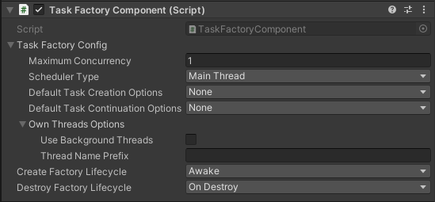
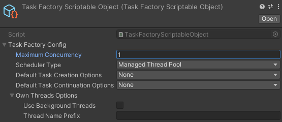

# TaskFactoryObject
`TaskFactoryObject` brings configurable `MonoBehaviour` and `ScriptableObject`
subclasses wrapping [TaskFactory](https://docs.microsoft.com/en-us/dotnet/api/system.threading.tasks.taskfactory?view=netstandard-2.0)
objects, easing the creation and sharing of task factories with custom
schedulers in Unity.


## TaskSchedulers
The [TaskSchedulers module](Runtime/TaskSchedulers/) comes with 3
[TaskScheduler](https://docs.microsoft.com/en-us/dotnet/api/system.threading.tasks.taskscheduler?view=netstandard-2.0)
implementations:

- [SyncTaskScheduler](Runtime/TaskSchedulers/SyncTaskScheduler.cs): run tasks
  in the current `SynchronizationContext`. Unless there are any custom
  `SynchronizationContext` registered as current, this scheduler will run
  tasks in Unity's Main Thread. Default maximum concurrency is `int.MaxValue`,
  that is, process every task in a single frame.
- [ManagedThreadPoolTaskScheduler](Runtime/TaskSchedulers/ManagedThreadPoolTaskScheduler.cs):
  run tasks in the [Managed Thread Pool](https://docs.microsoft.com/en-us/dotnet/standard/threading/the-managed-thread-pool).
  Default maximum concurrency is `Environment.ProcessorCount`.
- [OwnThreadsTaskScheduler](Runtime/TaskSchedulers/OwnThreadsTaskScheduler.cs):
  creates it's own threads and run tasks on them. Uses a
  [SemaphoreSlim](https://docs.microsoft.com/en-us/dotnet/api/system.threading.semaphoreslim?view=netstandard-2.0)
  for sleeping threads until there is work to be done. Threads can have their
  name and background flag configured. Default maximum concurrency is
  `Environment.ProcessorCount`.


## TaskFactoryComponent
The [TaskFactoryComponent](Runtime/TaskFactoryComponent.cs) is a
`MonoBehaviour` subclass with configurations for the created `TaskFactory`.
It also lets one choose in what lifecycle events the factory will be created
and destroyed. The `TaskScheduler` used by the factory is tied to these
lifetimes, so that when the factory is destroyed, no more tasks can be
scheduled and pending ones will be dropped silently.

If `MaximumConcurrency` is 0 or a negative number, the created `TaskScheduler`
will use it's own default.

Usage example:
```cs
using UnityEngine;
using Gilzoide.TaskFactoryObject;

public class SomeOtherScript : MonoBehaviour
{
    public TaskFactoryComponent FactoryComponent;

    async void Start()
    {
        TaskFactory taskFactory = FactoryComponent.Factory;
        await taskFactory.StartNew(() => Debug.Log("This is run in the configured TaskScheduler!"));
        Debug.Log("Done!");
    }
}
```




## TaskFactoryScriptableObject
The [TaskFactoryScriptableObject](Runtime/TaskFactoryScriptableObject.cs) is a
`ScriptableObject` subclass with configurations for the created `TaskFactory`.
The factory is created on the `OnEnable` event and destroyed on the `OnDisable`
event of this scriptable object. When the factory is destroyed, no more tasks
can be scheduled and pending ones will be dropped silently.

If `MaximumConcurrency` is 0 or a negative number, the created `TaskScheduler`
will use it's own default.

Usage example:
```cs
using UnityEngine;
using Gilzoide.TaskFactoryObject;

public class SomeOtherScript : MonoBehaviour
{
    public TaskFactoryScriptableObject FactorySO;

    async void Start()
    {
        TaskFactory taskFactory = FactorySO.Factory;
        await taskFactory.StartNew(() => Debug.Log("This is run in the configured TaskScheduler!"));
        Debug.Log("Done!");
    }
}
```


