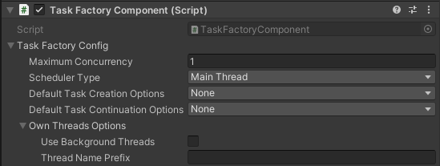

# TaskFactoryObject
[](https://openupm.com/packages/com.gilzoide.taskfactory-object/)

Configurable `MonoBehaviour` and `ScriptableObject` subclasses wrapping
[TaskFactory](https://docs.microsoft.com/en-us/dotnet/api/system.threading.tasks.taskfactory?view=netstandard-2.0)
objects plus a collection of [TaskScheduler](https://docs.microsoft.com/en-us/dotnet/api/system.threading.tasks.taskscheduler?view=netstandard-2.0)
implementations with limited concurrency. 


## Installing the package
Either:
- Use the [openupm registry](https://openupm.com/) and install this package using the [openupm-cli](https://github.com/openupm/openupm-cli):
  ```
  openupm add com.gilzoide.taskfactory-object
  ```
- Install via [Unity Package Manager](https://docs.unity3d.com/Manual/upm-ui-giturl.html) using this repository URL and tag:
  ```
  https://github.com/gilzoide/TaskFactoryObject.git#1.0.0
  ```
- Clone this repository directly inside your project's `Assets` or `Packages` folder.


## TaskSchedulers
The [TaskSchedulers module](Runtime/TaskSchedulers/) comes with the following
implementations:

- [SyncTaskScheduler](Runtime/TaskSchedulers/SyncTaskScheduler.cs): run tasks
  in the current `SynchronizationContext`, which by default is Unity's Main
  Thread. Default maximum concurrency is `int.MaxValue`, that is, process every
  queued task in a single frame.
- [ManagedThreadPoolTaskScheduler](Runtime/TaskSchedulers/ManagedThreadPoolTaskScheduler.cs):
  run tasks in the [Managed Thread Pool](https://docs.microsoft.com/en-us/dotnet/standard/threading/the-managed-thread-pool).
  Default maximum concurrency is `Environment.ProcessorCount`.
- [OwnThreadsTaskScheduler](Runtime/TaskSchedulers/OwnThreadsTaskScheduler.cs):
  creates its own threads and run tasks on them. Uses a
  [SemaphoreSlim](https://docs.microsoft.com/en-us/dotnet/api/system.threading.semaphoreslim?view=netstandard-2.0)
  for sleeping threads until there is work to be done. Threads can have their
  name and background flag configured. Default maximum concurrency is
  `Environment.ProcessorCount`.


## TaskFactoryComponent and TaskFactoryScriptableObject
[TaskFactoryComponent](Runtime/TaskFactoryComponent.cs) is a `MonoBehaviour`
subclass with configurations for creating `TaskFactory` and `TaskScheduler`
objects.
[TaskFactoryScriptableObject](Runtime/TaskFactoryScriptableObject.cs) is its
`ScriptableObject` counterpart, both work in the same way.

Their `Scheduler` property gets a configured `TaskScheduler` and their
`Factory` property gets a configured `TaskFactory`. These are created on demand
when accessing the properties.

The `TaskScheduler` and `TaskFactory`'s default `CancellationToken` are tied to
the lifetime of the objects and will be canceled automatically on
`TaskFactoryComponent`'s `OnDestroy` and `TaskFactoryScriptableObject`'s
`OnDisable` methods. When that happens, no more tasks can be scheduled and
pending ones will be dropped silently. One can also manually cancel them by
calling `DestroyFactory`. Accessing the `Scheduler` or `Factory` properties
afterwards recreates them.

If `MaximumConcurrency` is 0 or a negative number, the created `TaskScheduler`
will use its own default maximum concurrency, which depends on the
implementation.

Usage example:
```cs
using System.Threading.Tasks;
using UnityEngine;
using Gilzoide.TaskFactoryObject;

public class SomeOtherScript : MonoBehaviour
{
    public TaskFactoryComponent FactoryComponent;
    public TaskFactoryScriptableObject FactorySO;

    async void Start()
    {
        // using TaskScheduler directly
        Task task = new Task(() =>
        {
            Debug.Log("This runs in the TaskScheduler configured by FactoryComponent!");
        });
        task.Start(FactoryComponent.Scheduler);
        await task;

        // using the configured TaskFactory
        await FactoryComponent.Factory.StartNew(() =>
        {
            Debug.Log("This one too (FactoryComponent)!");
        });

        // using TaskScheduler directly, this time from FactorySO
        await Task.Delay(100).ContinueWith(_delayTask =>
        {
            Debug.Log("This continuation runs in the TaskScheduler configured by FactorySO!");
        }, FactorySO.Scheduler);

        Debug.Log("All done!");
    }
}
```




## TaskFactoryConfig
The [TaskFactoryConfig](Runtime/TaskFactoryConfig.cs) is a serializable class
with configurations for creating `TaskScheduler` and `TaskFactory` objects.
This is used by both `TaskFactoryComponent` and `TaskFactoryScriptableObject`.

Methods:
- `TaskScheduler CreateScheduler(CancellationToken cancellationToken = default)`:
  creates a new `TaskScheduler` with the defined configuration.
- `TaskFactory CreateFactory(CancellationToken cancellationToken = default)`:
  creates a new `TaskFactory` with the defined configuration. A `TaskScheduler`
  is also created via `CreateScheduler` and passed to it.
- `TaskFactory CreateFactory(TaskScheduler taskScheduler, CancellationToken cancellationToken = default)`:
  creates a new `TaskFactory` with the defined configuration, using a specific
  scheduler object.
